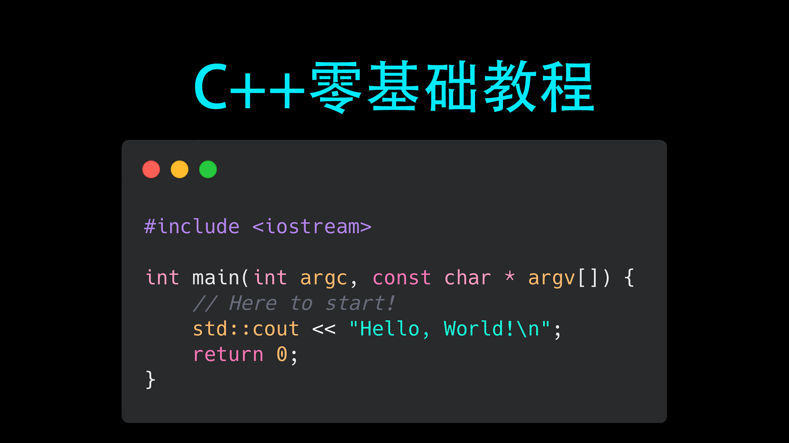

# C++ Base Tutorial
 

# 介绍
这是一个简短的c++零基础教程，你可以通过本教程对c++有一个基本的了解

# 第一个程序
## 代码结构
- 预处理标识(引入头文件)  # + 预处理指令 如`#include <iostream>`和`#include "stb_image.h"`
- main(主)函数
- 注释 程序会忽略这些文字 如 `//注释一行`和`/*注释一串*/`

# cout
- 用法 `cout << 值`
- 换行 `cout << '\n'`或`cout << endl`或`endl(cout)`

# 变量
- 声明 `类型 变量名{初始化}`
- 赋值 `变量名 = 值`
- 全局变量 在函数外定义的变量称之为全局变量

# cin
- 用法 `cin >> 变量` cin以空格和换行为间隔，而且一般终端在换行后才会处理输入
- 注意 必须输入对应的类型

# 判断
## if
- 用法
```c++
if(条件 /*true 真 false 假 输入值则0为假,否则为真*/) {
    // 满足条件执行的
} else {
    // 不满足条件执行的
}
```
- 逻辑表达式
```c++
==    等于
>     大于
<     小于
>=    大于等于
<=    小于等于
!=    不等于

&&    与
||    或
!     非
```
## switch
- 用法
```c++
switch (整数){
    case 1:
        // 要执行的语句
        break;
    // ...
    default:
        // 没有符合的值时执行的
}
```

# 循环
## 数组
数组,就是相同数据类型的元素按一定顺序排列的集合
- 声明 `类型 数组名[长度] = {初始化}`
- 用法 `数组名[下标] // 下标从0开始`
## for
- 用法
```c++
for(初始化/*循环开始前执行*/; 循环条件/*每轮开始前执行*/; 转化/*每轮结束时执行*/){
    // 循环的语句
}
```
## while
- 用法
```c++
while(条件){
    // 循环的语句
}
```
## do while

```c++
do{
    // 循环的语句
}while(条件); // 会先运行一遍语句,再判断
```
## 循环中的指令
- `break`退出循环
- `continue`进入下一轮循环

# 类型
## 整数类型
- char  8位(1字节)
- short  16位(2字节)
- int  32位(4字节) // 据说 32位操作系统上是 16位(2字节) 无从考究
- long 32位(4字节)
- long long 64位(8字节)
## 浮点数类型
- float 4字节
- double 8字节
- long double 16字节 但是,部分编译器上 8字节(如:MSVS)
## 布尔类型
- bool true/false
## 自定义类型
- struct 结构体
- union 联合体 不过多介绍
- enum 枚举 不过多介绍
- class 类 不过多介绍

# 容器
## vector
- 声明 `vector<类型> 容器名(长度)` 或 `vector<类型> 容器名{元素0, 元素1, 元素2, ...} // 使用{}则会初始化元素`
- 追加元素 `容器名.push_back(值) // 在末尾增加一个元素`
- 检测长度 `容器名.size()`
## string
- 声明 `string str = "字符串"`
- 截取 `str.substr(pos, length)`
- 查找 `str.find('字符')`或`str.find("字符串") // 找开始的位置`
- 长度 `str.size()`

# 函数
- 定义
```c++
类型 函数名(类型 变量名, ...){
    // 函数执行的语句
    return ...;
}
```
- 作用域 用{}括起来的都是作用域,一般变量再离开声明其的作用域后会被释放
- 递归

# 指针
- 声明 `类型* 指针名`
- 用法
```c++
指针名 = &变量名 // 指向变量
*指针名 // 解指针
指针名->成员名 // 使用结构体中的成员
```
## 引用
- 用法 `类型& 引用名 = 变量名`
- 改变解指针和引用的值,所指向或引用的变量的值也会改变
## new delete
- 用法 `类型* 指针名 = new 类型{初始化}`或`类型* 指针名 = new 类型[长度]{初始化} // 数组`
- 释放 `delete 指针名 // 单个变量`或`delete[] 指针名 // 数组`
## 深浅拷贝与函数形实参

# 数据结构
- node 节点
```c++
struct node{
    int a;
    node* n;
};
```
- 链表 将node连起来
- 队列 先进先出,后进后出
- 栈 先进后出,后进先出

# 文件读写
## 传统方法
```c++
FILE* fp = fopen(路径, 模式/*"r","w","a","r+","w+","a+", ...*/); // 打开文件
vector<char> v{};
while(!feco(fp)) v.push_back(fgetc(fp));
v.pop_back(); // 推出文件结束符

fputs("字符串"， fp); // 写文件
```
## 现代方法
```c++
ifstream ifs{路径}; // 读
stringstream ss;
ss << ifs.rdbuf(); // 读取整个文件

ofstream ofs{路径}; // 写
ofs << 值;
```
